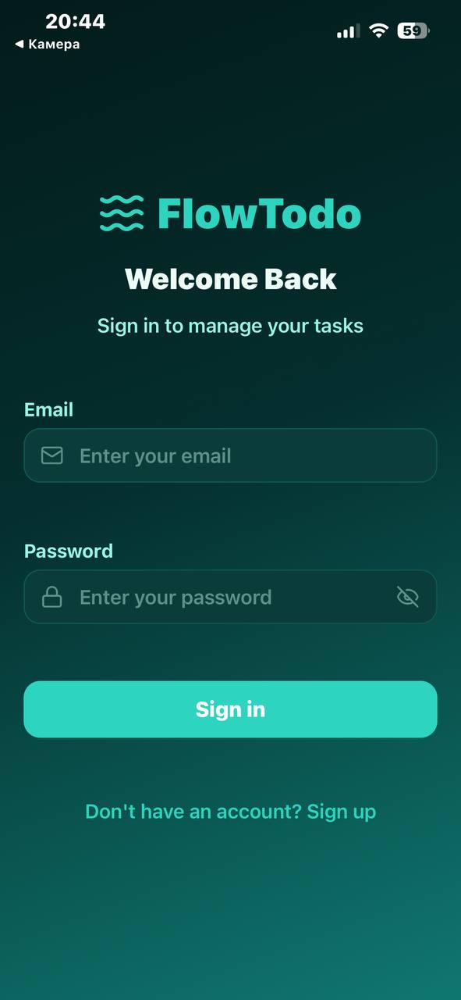
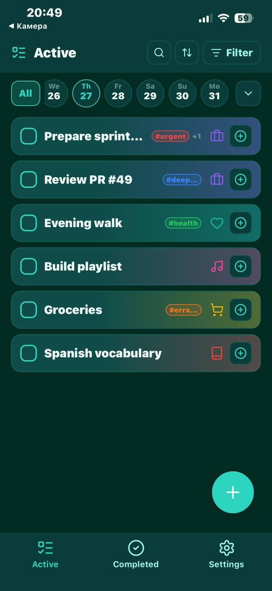
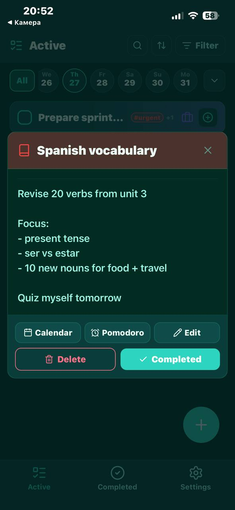
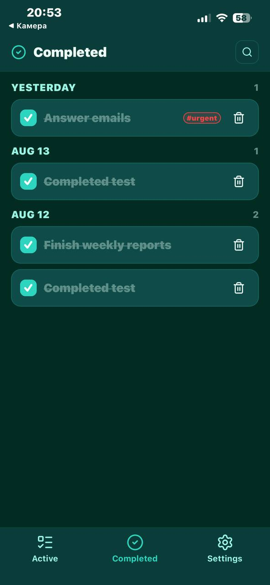
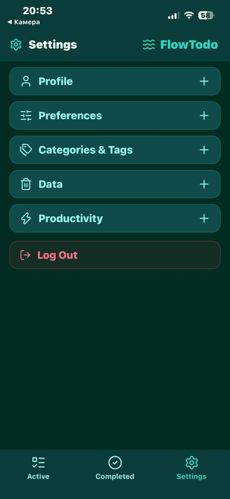
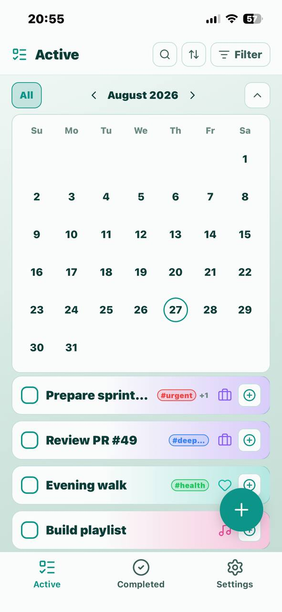

# FlowTodo

Port [NextTodo](https://github.com/matt400/NextTodo) na **Expo (React Native)** + **Supabase** — iOS, Android i web z jednej bazy kodu.

**Live (web):** [flowtodo-expo-supabase.vercel.app](https://flowtodo-expo-supabase.vercel.app)  
**v1.0.0:** [Release](https://github.com/ep1cvoice/flowtodo-expo-supabase/releases/tag/v1.0.0) — APK in v1.0.0 release.

## Screenshots

| | |
|:--|:--|
|  |  |
| *Log in* | *Active* |
|  |  |
| *Task detail* | *Completed* |
|  |  |
| *Settings* | *Active (light)* |

## Status

**v1.0** — core flow jest spięty z Supabase (auth, tasks, pomodoro, settings).

| Obszar | Stan |
|--------|------|
| Auth (login / register / session) | Supabase Auth + `profiles` |
| Change password / delete account | Settings + RPC `delete_own_account` |
| Theme + Pomodoro duration | Zapis w `profiles` |
| Tasks / categories / tags | Supabase + RLS; demo seed dla nowych userów |
| Pomodoro timer + historia | Tabela `pomodoros` + UI |
| Splash screen | Brand overlay przy starcie sesji |
| Drag & drop / reorder | Native: long-press; web: ↑/↓; `sort_order` w DB |
| Toasty | Globalny `ToastContext` / `ToastHost` |
| Haptics | Drag, complete, delete (native) |
| Network awareness | Offline banner + refetch on reconnect; network toasts |

## Stack

| Warstwa | Wybór |
|---------|--------|
| Framework | Expo SDK **54** + Expo Router |
| Package manager | **Bun** (`bun.lock`) — Node.js LTS still needed for some Expo commands |
| UI | React Native + `react-native-web`, StyleSheet |
| Ikony | `lucide-react-native` |
| Auth / DB | Supabase (`supabase-js`), sesja w AsyncStorage |
| Gestures / DnD | `gesture-handler`, `reanimated`, `react-native-sortables` |
| Feedback | `expo-haptics`, custom toasts |
| Dźwięk | `expo-av` (alarm Pomodoro) |

## Supabase migrations

Kolejność w `supabase/migrations/`:

1. `001_profiles.sql` — profil + settings
2. `002_tasks_domain.sql` — tasks / categories / tags + RLS
3. `003_grants.sql` — GRANTy dla `authenticated`
4. `004_delete_own_account.sql` — RPC usuwania konta
5. `005_pomodoros.sql` — sesje i historia Pomodoro
6. `006_tasks_completed_at.sql` — `completed_at` na taskach
7. `007_filter_limits.sql` — wspólny limit filtrów (`max_filter_selections`, 5–30)

Odpal migracje w projekcie Supabase (SQL Editor albo CLI) w tej kolejności na świeżej bazie.

## Run

Install [Bun](https://bun.sh/docs/installation), then:

```bash
bun install
cp .env.example .env   # uzupełnij klucze lokalnie
bun start -- -c
```

`w` = web · Expo Go = QR z terminala · SDK celowo **54** pod aktualne Expo Go.

| Zadanie | Komenda |
|---------|---------|
| Dev server | `bun start` |
| Android | `bun run android` |
| iOS | `bun run ios` |
| Web | `bun run web` |
| Dodać bibliotekę Expo | `bun expo install <pkg>` |

## Android APK

```bash
bunx eas-cli login
bunx eas-cli build:configure   # once — links Expo projectId into app.json
bunx eas-cli env:set preview --name EXPO_PUBLIC_SUPABASE_URL --value "https://YOUR.supabase.co" --visibility plaintext --non-interactive
bunx eas-cli env:set preview --name EXPO_PUBLIC_SUPABASE_ANON_KEY --value "your_anon_key" --visibility sensitive --non-interactive
bunx eas-cli build -p android --profile preview
```

Profil `preview` w `eas.json` buduje **APK** (nie AAB). Po buildzie Expo daje link do pobrania — na telefonie trzeba zezwolić na instalację z nieznanych źródeł. EAS używa Buna, bo w repo jest `bun.lock`.

## Web (Vercel)

Push na `main` odpala deploy. Env na Vercelu (build-time): `EXPO_PUBLIC_SUPABASE_URL`, `EXPO_PUBLIC_SUPABASE_ANON_KEY`. Config: `vercel.json`.

## Tests

```bash
bun run test
```

Używaj `bun run test`, nie `bun test` — to drugi runner, nie Jest.

Stack: **Jest** + **jest-expo** + **@testing-library/react-native**.  
Must-have coverage for now: auth validation (+ login smoke), network errors, task/pomo mappers, filtered reorder, offline banner.
